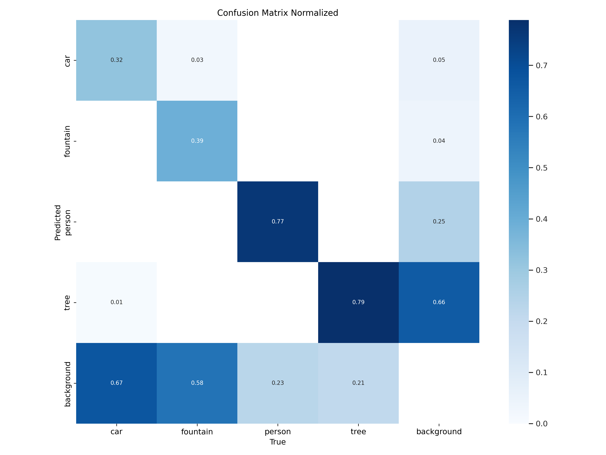
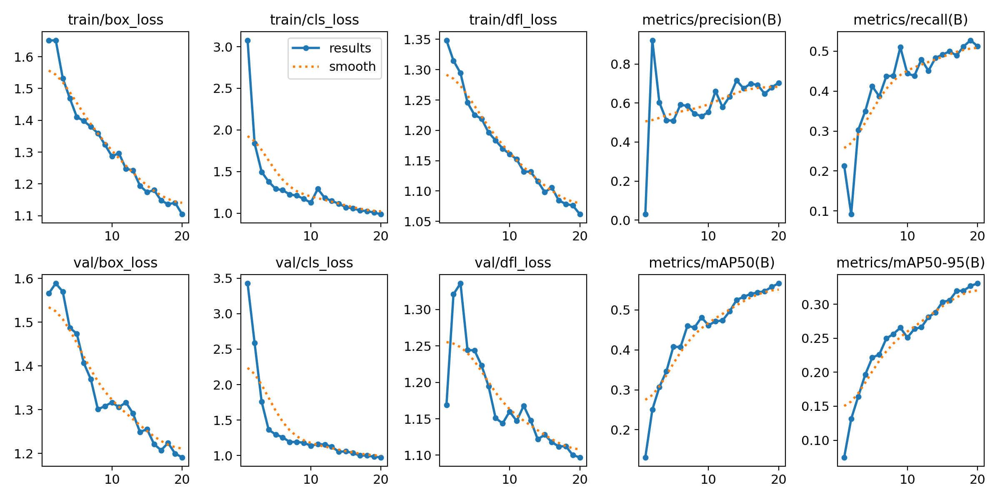
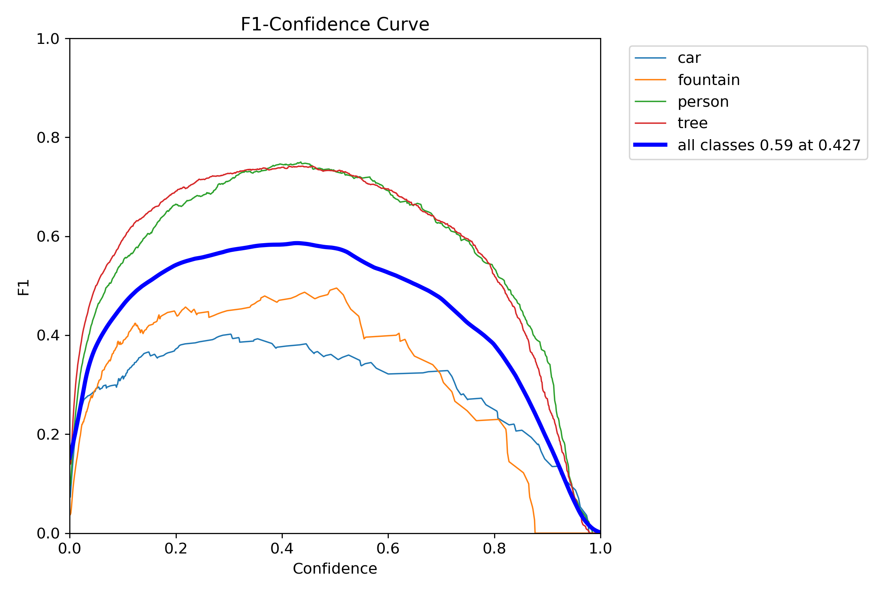
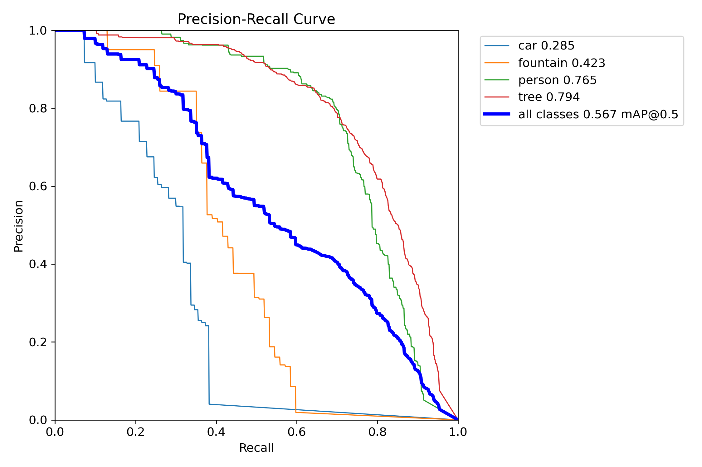

# Object Detection using YOLOv11 - Custom Dataset

Repository ini berisi proyek deteksi objek kustom menggunakan model **YOLOv11 Nano (yolo11n)** untuk mendeteksi empat kategori objek di lingkungan kampus: **car (mobil)**, **fountain (air mancur)**, **person (orang)**, dan **tree (pohon)**.

Dataset yang digunakan berasal dari Roboflow (v2) dengan total 755 gambar berukuran $1280 \times 720$ piksel.

---

## 🚀 Alur Kerja Proyek (Step-by-Step)

### Langkah 1: Persiapan Environment
Pastikan Anda memiliki Python (versi 3.8 ke atas) dan instal semua pustaka dependensi yang dibutuhkan:
```bash
pip install ultralytics opencv-python tqdm requests pycocotools
```

### Langkah 2: Persiapan Dataset & Konfigurasi
1. Dataset diekstrak dari file `Yoloww.zip` ke dalam folder proyek. Struktur folder dataset disusun sebagai berikut:
   ```text
   datasets + code/
   ├── train/
   │   ├── images/
   │   └── labels/
   ├── valid/
   │   ├── images/
   │   └── labels/
   ├── test/
   │   ├── images/
   │   └── labels/
   └── data.yaml
   ```
2. File konfigurasi **[data.yaml](./datasets%20+%20code/data.yaml)** mendefinisikan lokasi data dan label objek:
   ```yaml
   train: ../train/images
   val: ../valid/images
   test: ../test/images

   nc: 4
   names: ["car", "fountain", "person", "tree"]
   ```

### Langkah 3: Pelatihan Model (Training)
Pelatihan model dilakukan menggunakan model pra-terlatih `yolo11n.pt` selama **20 epoch** dengan ukuran gambar input 640 piksel. Perintah CLI yang dijalankan:
```bash
yolo train model=yolo11n.pt data=data.yaml epochs=20 imgsz=640
```
Proses pelatihan menghasilkan bobot model terbaik (`best.pt`) dan bobot terakhir (`last.pt`) di dalam folder hasil training.

### Langkah 4: Evaluasi Model
Model dievaluasi menggunakan data validasi untuk mengukur akurasi deteksi melalui metrik *Precision*, *Recall*, dan *mean Average Precision (mAP)*.

### Langkah 5: Prediksi Real-Time (Inference)
Deteksi objek secara langsung menggunakan kamera (webcam) atau file video dapat dijalankan dengan memuat bobot model hasil training (`best.pt`) menggunakan OpenCV:
```python
import cv2
from ultralytics import YOLO

# Load model terbaik hasil training
model = YOLO('datasets + code/best.pt')

# Hubungkan ke kamera eksternal / internal (ID: 0)
cap = cv2.VideoCapture(0)

while True:
    ret, frame = cap.read()
    if not ret:
        break

    # Jalankan deteksi
    results = model(frame)
    annotated_frame = results[0].plot()

    # Tampilkan frame hasil deteksi
    cv2.imshow('YOLOv11 Real-Time Detection', annotated_frame)
    if cv2.waitKey(1) & 0xFF == ord('q'):
        break

cap.release()
cv2.destroyAllWindows()
```

---

## 📊 Hasil Pelatihan & Evaluasi

Setelah pelatihan selama 20 epoch, model mencapai nilai **mAP50 sebesar 0.565** dan **mAP50-95 sebesar 0.324** untuk keseluruhan kelas.

### Rincian Akurasi per Kelas:
| Kelas | Jumlah Sampel (Instances) | Precision (P) | Recall (R) | mAP50 | mAP50-95 |
| :--- | :---: | :---: | :---: | :---: | :---: |
| **All Classes** | 1565 | 0.680 | 0.532 | 0.565 | 0.324 |
| **Car (Mobil)** | 110 | 0.569 | 0.277 | 0.277 | 0.096 |
| **Fountain (Air Mancur)** | 77 | 0.675 | 0.416 | 0.437 | 0.189 |
| **Person (Orang)** | 351 | 0.738 | 0.709 | 0.755 | 0.487 |
| **Tree (Pohon)** | 1027 | 0.739 | 0.725 | 0.792 | 0.523 |

### Grafik Metrik Performa:
Berikut adalah kurva hasil training yang tersimpan dalam repositori:

#### 1. Confusion Matrix (Normalized)
Menggambarkan tingkat akurasi prediksi model terhadap label asli untuk setiap kelas.


#### 2. Progress Hasil Training (Results)
Grafik loss fungsi (box_loss, cls_loss, dfl_loss) serta performa metrik (mAP) selama 20 epoch pelatihan.


#### 3. Kurva F1-Score & Precision-Recall (PR)
Menunjukkan keseimbangan sensitivitas (Recall) dan kepresisian (Precision) model.



---

## 🎥 Hasil Uji Coba Video
Beberapa file rekaman hasil uji coba deteksi objek langsung pada video sampel telah disertakan dalam repositori. Anda dapat mengklik tautan di bawah ini untuk memutar/mengunduh file video tersebut:
* [Video Uji Coba 1 (2024-11-11 15-17-30.mp4)](./2024-11-11%2015-17-30.mp4)
* [Video Uji Coba 2 (2024-11-11 15-19-25.mp4)](./2024-11-11%2015-19-25.mp4)
* [Video Uji Coba 3 (2024-11-11 15-21-17.mp4)](./2024-11-11%2015-21-17.mp4)
